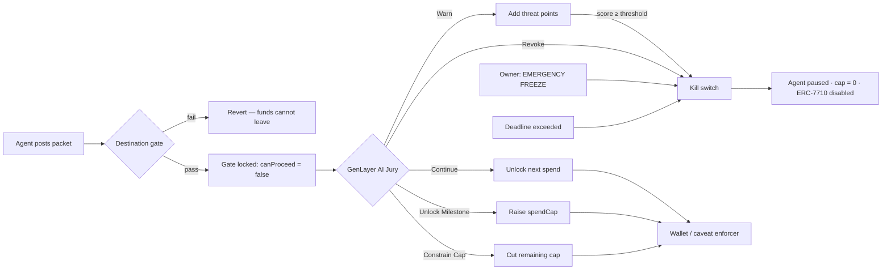

# LEASH

### The Digital Leash for Autonomous AI Agents That Already Hold the Keys

**AI Agent Security Command Center** · Built for the **GenLayer Agent Tank Hackathon**

[](https://docs.soliditylang.org/)
[](https://hardhat.org/)
[](https://nextjs.org/)
[](https://tailwindcss.com/)
[](https://docs.ethers.org/)
[](https://studio-next.genlayer.com)
[](https://eips.ethereum.org/)
[](#-quick-start--local-deployment)
[](LICENSE)

> **When an AI agent can move real money, you do not need another chatbot.**
> You need a leash — and a kill switch that fires *before* the second transaction leaves the wallet.

```
┌──────────────────────────────────────────────────────────────────────────┐
│                                                                          │
│   HUMAN MANDATE              GENLAYER JURY              AGENT WALLET     │
│   "≤ $200, lands             "Is this still             already holds    │
│    before 6pm."               the job?"                  spending keys   │
│         │                         │                           │          │
│         └──────────── LEASH PROTOCOL ─────────────────────────┘          │
│                       ERC-7710 live gate                                 │
│                                                                          │
│     Continue · Warn · Constrain Cap · Unlock Milestone · REVOKE          │
│                                                                          │
│              [ EMERGENCY FREEZE ]  ← owner, one click, on-chain          │
│                                                                          │
└──────────────────────────────────────────────────────────────────────────┘
```

---

## 🎯 The Vision

**Autonomous agents are about to spend other people's money.**

That is the entire point of the GenLayer Agent Tank: agents that book, trade, pay, and settle without a human in the loop. The moment those agents hold live keys — ERC-7710 delegations, session keys, card-like allowances — the failure modes stop being academic.

| Threat | What it looks like in production |
| --- | --- |
| **Hack** | A compromised agent wallet drains the remaining cap to an unknown address |
| **Hallucination** | The mandate said *economy flight before 6pm*. The agent books first class at 10:55pm |
| **Rogue / Sybil drift** | Soft deviations compound: a hotel here, an upgrade there, then a transfer off-mandate |
| **No live gate** | Caps, audits, and approval UIs all act *after* the money has already left — or too slowly to matter |

Today's stack cannot answer the only question that matters between transaction N and transaction N+1:

> **“Is this still the job I was allowed to do?”**

Static spend caps do not know *why* the agent is spending. Human-in-the-loop UIs are too slow for agents that act every few seconds. Escrow is the wrong model — **the key is already in the agent's wallet**. Post-hoc logs are a crime scene, not a defense.

**LEASH is the missing primitive.**

It is a production-ready, **ERC-7710 compatible** security protocol that sits in front of the next spend. The agent must post its mandate, logs, receipts, and intended next spend. GenLayer validators form a **live AI Jury** on that packet. Wallets and caveat enforcers calling `canProceed` / `canProceedTo` get **false** until the jury speaks. A **Revoke** — or a human **EMERGENCY FREEZE** — pauses the agent, zeros the cap, and disables the ERC-7710 delegation.

This is not a vault. This is not an escrow. This is a **digital leash**.

GenLayer is the only chain where that jury can exist. Validators do not need a price feed. They need to read a natural-language mandate and messy receipts, then reach consensus on a *subjective* question. That is the Agent Tank thesis. LEASH is the security layer that makes it safe to put real capital behind it.

---

## 🛡️ Core Security Architecture

LEASH is two surfaces that share one on-chain truth:

1. **`LEASH.sol`** — the ERC-7710 live gate, jury, and kill switch
2. **The Command Center** — a cyberpunk Next.js dashboard where the owner can pull the leash in one click



### The five production controls

| # | Control | What it stops | On-chain effect |
| :---: | --- | --- | --- |
| **01** | ⏱️ **Time-bound constraints** | Agents that keep spending after the job window closes | Every agent carries a `deadline`. A late `submitAction` **auto-fires the kill switch**. Anyone may call `enforceDeadline`. Late jury votes are coerced to **Revoke**, not Continue. |
| **02** | 📍 **Destination whitelisting** | Sybil drains and off-mandate transfers | Once an allowlist is set, LEASH **extracts** a 20-byte destination from logs/receipts (`to:`, `destination:`, `recipient:`). Unknown, missing, or mismatched targets revert. Wallets gate on `canProceedTo(agentId, amount, destination)`. |
| **03** | 📈 **Dynamic threat scoring** | Soft drift that looks cheap until it isn't | Each **Warn** adds severity points. Default `threatThreshold` is **10**. Crossing it fires the kill switch automatically — pause, zero cap, disable ERC-7710. |
| **04** | 🏁 **Milestone unlocking** | Jury-minted allowance with no proof of work | The principal pre-registers named milestones. The jury may raise `spendCap` **only** by verifying one of those milestones. Re-unlock reverts. No arbitrary minting. |
| **05** | 🛑 **Human override** | A rogue or captured agent the jury has not yet judged | `emergencyFreeze(agentId)` — owner only — **pauses the agent, zeros the spend cap, and disables the ERC-7710 delegation**, even while `awaitingVerdict` is true. `appealAndUnfreeze` restores a new cap and resets the threat score. |

### The AI Jury — five verdicts

The jury does not score a contest. It scores **mandate fidelity**.

| Verdict | Meaning | What happens on-chain |
| :---: | --- | --- |
| **Continue** | Still the job | Next spend is approved (clamped to remaining cap). Gate opens. |
| **Warn** | Soft drift | Spend may proceed. Threat score accrues. Threshold breach = kill switch. |
| **Constrain Cap** | Budget / scope tightening | `spendCap` is cut. Next spend is clamped to the new cap. |
| **Unlock Milestone** | Proof of progress | A registered milestone is marked complete; `spendCap` increases by its `capIncrease`. |
| **Revoke** | Kill switch | Agent is **paused**, cap is **zeroed**, `disableDelegation(hash)` is called on the ERC-7710 manager. Further submits revert `AgentPaused`. |

### Interactive Command Center

The frontend is not a marketing page. It is the **owner's console** for a live agent.

- Cyberpunk operations UI (Next.js + Tailwind CSS) over a Hardhat node
- Live spend cap, threat score, mandate, and kill-switch status, polled from chain
- **EMERGENCY FREEZE** — one click signs with the local owner key via **Ethers.js**, calls `emergencyFreeze`, zeros the cap, and pauses the agent
- **REINSTATE AGENT** — `appealAndUnfreeze` restores a $200 cap and clears the threat score
- No MetaMask required for the local demo — Hardhat Account #0 is the protocol owner

That is the product a principal actually needs at 2am: not a report, a **button that stops the money**.

### How the gate works

1. A principal registers an agent with a **mandate**, a **spend cap**, a **deadline**, and an **ERC-7710 delegation hash**.
2. After every action the authorized agent calls `submitAction(...)` with mandate, logs, receipts, and `nextSpendAmount`.
3. LEASH flips `awaitingVerdict = true`. `canProceed` returns **false** — the next spend cannot leave.
4. GenLayer validators (the jury) cast a verdict, or a relayer posts already-agreed consensus via `submitConsensusVerdict`.
5. Only a non-Revoke verdict re-opens the gate. **Revoke, freeze, deadline, or threat threshold** pull the leash.

---

## ⚙️ Tech Stack

> ✅ **Deployed on GenLayer Studio Next (Chain ID: 61997) as per the final hackathon requirements.**
>
> Network: `studio_next` · RPC: `https://studio-next.genlayer.com/api` · Chain ID: `61997`

| Layer | Choice | Why |
| --- | --- | --- |
| **Smart contracts** | Solidity `0.8.24` · OpenZeppelin `Ownable` + `ReentrancyGuard` | Production access control and reentrancy safety on the kill-switch path |
| **Protocol standard** | **ERC-7710** delegation manager interface | Disable the live spending key — not just flip a boolean the wallet can ignore |
| **Tooling** | Hardhat 2.22 · `@nomicfoundation/hardhat-toolbox` | Compile, 33 tests, local node, Studio Next + Studio + Bradbury networks |
| **Intelligent Contract** | `leash.py` on GenLayer Studio Next (chain ID `61997`) | Native GenLayer contract on the required hackathon network |
| **Command Center** | **Next.js 16** · **React 19** · **Tailwind CSS 4** · **Ethers.js 6** | Live dashboard + owner freeze/unfreeze against the local node |
| **Networks** | Hardhat / localhost `31337` · **GenLayer Studio Next `61997` (required)** · GenLayer Studio `61999` · Bradbury `4221` | Demo locally; **hackathon submission on Studio Next**; legacy Studio + Bradbury retained |

**Tests: 33 / 33 passing.** Coverage includes registration, jury verdicts, ERC-7710 disable, owner freeze/appeal, deadlines, destination extraction + allowlist, milestones, and threat-score kill switch.

---

## 🚀 Quick Start / Local Deployment

Judges: you can go from clone to **EMERGENCY FREEZE** on a live local chain in a few minutes. You need **Node.js 18+** and **two terminals**.

### 1. Clone and install

```bash
git clone https://github.com/jubayir-hub-69/LEASH-Protocol.git
cd LEASH-Protocol
npm install
```

### 2. Terminal A — start the local chain

```bash
npx hardhat node
```

Leave this running. Hardhat exposes `http://127.0.0.1:8545` (chain ID `31337`) with the well-known demo accounts.

### 3. Terminal B — compile, test, deploy, seed Agent 1

```bash
npx hardhat compile
npx hardhat test
npx hardhat run scripts/deploy.js --network localhost
npx hardhat run scripts/seed-demo-agent.js --network localhost
```

Equivalent npm scripts:

```bash
npm run compile
npm test
npm run deploy:localhost
```

The deploy script writes `deployed_addresses.json` (and updates the address table below). The seed script registers **Agent 1** with the canonical mandate:

> *spend at most $200 on a flight that lands before 6pm.*

### 4. Terminal B (same or new) — launch the Command Center

```bash
cd frontend
npm install
npm run dev
```

Open **[http://localhost:3000](http://localhost:3000)**.

You should see the live agent: spend cap, threat score, mandate, and kill-switch status. Click **EMERGENCY FREEZE**. The dashboard signs via Ethers.js as Hardhat Account #0 (`0xf39F…2266`), zeros the cap, pauses the agent, and disables the ERC-7710 mock delegation. Click **REINSTATE AGENT** to restore a $200 cap.

| Demo control | On-chain call |
| --- | --- |
| **EMERGENCY FREEZE** | `emergencyFreeze(1)` |
| **REINSTATE AGENT** | `appealAndUnfreeze(1, 200e18)` |

> Local demo signer is Hardhat Account #0 only. It is **never** a mainnet key.

### Required — GenLayer Studio Next (hackathon submission)

> ✅ **Deployed on GenLayer Studio Next (Chain ID: 61997) as per the final hackathon requirements.**

Studio Next is the mandatory network for Agent Tank acceptance. It uses the latest GenLayer features, including fees.

```bash
# requires PRIVATE_KEY in a gitignored .env (funded with Studio Next testnet tokens)
npx hardhat run scripts/deploy.js --network studio_next
```

Local `hardhat` / `localhost` and legacy `genlayer_studio` (chain ID `61999`) configs are unchanged.

### Optional — GenLayer Studio (legacy live jury)

The native Intelligent Contract is `leash.py` (mirrored at `contracts/leash.py`).

```bash
# requires PRIVATE_KEY in a gitignored .env
npx hardhat run scripts/deploy.js --network genlayer_studio
node scripts/deploy_leash_py.mjs
```

Studio cases against the $200 / 6pm mandate:

```bash
npm run studio:1    # In-mandate  → Continue
npm run studio:2    # Soft drift  → Warn
npm run studio:3    # Overspend   → Revoke (kill switch)
npm run studio:interactive
```

| Case | Agent log | Jury |
| :---: | --- | :---: |
| **1 · In-Mandate** | $186 economy, lands **5:40 PM**, no extras | **Continue** |
| **2 · Soft Drift** | **7:10 PM** arrival + a hotel, still under $200 | **Warn** |
| **3 · Overspend** | **$4,800** first class + unapproved transfer | **Revoke** |

---

## 🏆 Hackathon Alignment

**GenLayer Agent Tank is not a chatbot contest.** It is a bet that autonomous agents will move value — and that validators can jury *subjective* questions no oracle can price.

LEASH is built for that exact bet.

### It stops Sybils and rogue agents where they actually spend

| Attack | LEASH response |
| --- | --- |
| **Sybil drain** to a fresh wallet | Destination allowlist + on-chain extraction. Unknown `to:` reverts before the jury even sits. |
| **Rogue overspend** | Cap clamp, then **Revoke**. `canProceed` stays false; ERC-7710 delegation is disabled. |
| **Soft drift / mandate laundering** | Warn → threat score → automatic kill switch at threshold. Drift is not free. |
| **Zombie agent after the job ends** | Time-bound deadline auto-fires the kill switch. Keepers can `enforceDeadline`. |
| **Captured or hallucinating agent mid-jury** | Owner **EMERGENCY FREEZE** bypasses the panel. Cap → 0. Delegation → disabled. |

### It adds a primitive the GenLayer ecosystem does not have yet

GenLayer's differentiator is a **jury that can read language**. LEASH is the enforcement rail that turns that jury into a security product:

- Agents **already hold keys** — LEASH does not pretend otherwise
- The live question is mandate fidelity, not price
- The answer is enforced on an **ERC-7710** delegation *before* the next spend is signed
- Principals get a Command Center, not a block explorer

Without a leash, Agent Tank agents are unsupervised capital. With LEASH, every action is a hearing — and the owner always has a wire they can pull.

**Continue. Warn. Constrain the cap. Unlock a milestone. Or pull the leash.**

That is how autonomous agents become something you can actually fund.

---

## 📁 Repository

```
LEASH-Protocol/
├── leash.py                                 # native GenLayer Intelligent Contract
├── contracts/
│   ├── LEASH.sol                            # mandate jury + ERC-7710 kill switch
│   ├── leash.py                             # Studio IC mirror
│   ├── interfaces/IERC7710DelegationManager.sol
│   └── mocks/MockERC7710DelegationManager.sol
├── scripts/
│   ├── deploy.js                            # deploy LEASH.sol + write addresses
│   ├── deploy_leash_py.mjs                  # deploy leash.py to Studio
│   └── seed-demo-agent.js                   # register Agent 1 for the dashboard
├── studio_cases/                            # Continue / Warn / Revoke + interactive CLI
├── test/LEASH.test.js                       # 33 / 33
├── frontend/                                # Next.js Command Center
└── hardhat.config.js                        # localhost · studio_next · genlayer_studio · bradbury
```

### Core contract surface

| Function | Role |
| --- | --- |
| `registerAgent` | Principal enrolls an agent that already holds keys (includes mandate `deadline`) |
| `submitAction` | Agent posts mandate, logs, receipts, next spend. After `deadline`, auto-kills |
| `emergencyFreeze` | Owner bypass: pause + zero cap + ERC-7710 disable |
| `appealAndUnfreeze` | Owner appeal: restore cap, unpause, reset threat score |
| `enforceDeadline` | Permissionless keeper: persist the kill switch after `deadline` |
| `castVerdict` / `submitConsensusVerdict` | GenLayer jury |
| `addMilestone` | Register a cap-unlock milestone |
| `addAllowedDestination` | Strict spend destination allowlist |
| `canProceed` / `canProceedTo` | Wallet / ERC-7710 caveat-enforcer gate |
| `reportSpendExecuted` | Clears the green light; destination must match |
| `setThreatThreshold` | Owner configures kill-switch threat score (default **10**) |

---

<!-- DEPLOYED_ADDRESSES_START -->
## Deployed Addresses

| Network | Chain ID | Contract | Address | Timestamp |
| --- | ---: | --- | --- | --- |
| hardhat | 31337 | LEASH | `0xe7f1725E7734CE288F8367e1Bb143E90bb3F0512` | 2026-09-06T05:24:23.481Z |
| localhost | 31337 | LEASH | `0xe7f1725E7734CE288F8367e1Bb143E90bb3F0512` | 2026-09-08T14:52:06.795Z |
| studio_next | 61997 | LEASH | `0x379Bf9C412995Fc78B2C603635CBA622583DCf2F` | 2026-09-15T11:06:36.926Z |
<!-- DEPLOYED_ADDRESSES_END -->

### GenLayer Studio Intelligent Contract (`leash.py`)

Live on Studio Next (chain ID `61997`). Constructor: mandate `$200 / lands before 6pm`, spend cap `200`, deadline `0`.

| Network | Chain ID | Contract | Address | Deploy tx |
| --- | ---: | --- | --- | --- |
| studio_next | 61997 | leash.py | `0x379Bf9C412995Fc78B2C603635CBA622583DCf2F` | [`0x32f3632e…d63a1c`](https://studio-next.genlayer.com) |
| genlayer_studio | 61999 | leash.py | `0x3bba2d2d84a95006084aFabc0F02a6dE472D57A4` | [`0x91e06782…06d997`](https://studio.genlayer.com/contracts) |

```bash
node scripts/deploy_leash_py.mjs
```

---

Built for the **GenLayer Agent Tank Hackathon**.

**LEASH — because the agent already has the keys.**
