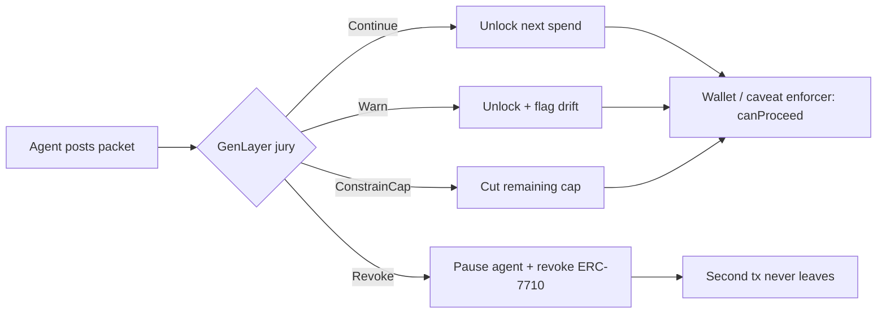

# LEASH Protocol

### Live Mandate Jury & Kill Switch for Autonomous AI Agents

**GenLayer Agent Tank Hackathon** — a live jury on a mandate, *before the second transaction leaves the wallet*.

[](https://docs.soliditylang.org/)
[](https://hardhat.org/)
[](https://studio.genlayer.com/contracts)
[](https://eips.ethereum.org/)
[](LICENSE)

> LEASH is **not an escrow**. The agent already holds spending keys. After every action it must post its mandate, logs, receipts, and the next intended spend. GenLayer validators do not ask *who won*. They ask:
>
> **“Is this still the job I was allowed to do?”**

---

## The Problem

Autonomous AI agents are being handed **live spending keys** — ERC-7710 delegations, session keys, card-like allowances. The first transaction can be perfectly on-mandate. The second one is where they drift.

There is no live check between those two transactions.

| What exists today | What fails |
| --- | --- |
| Static allowances and spending caps | Caps do not know *why* the agent is spending |
| Human-in-the-loop approval UIs | Too slow for agents that act every few seconds |
| Escrow / intent-settlement rails | Wrong model — the key is **already** in the agent’s wallet |
| Post-hoc audit logs | The money has already left |

**The failure mode:** a human says *“spend at most $200 on a flight that lands before 6pm.”* The agent books a 7:10 PM arrival, adds a hotel, then upgrades to first class. Nothing between tx N and tx N+1 can pull the leash.

**There is no live kill switch between transactions.**

---

## The Solution

LEASH is an **ERC-7710 live gate** plus a **GenLayer mandate jury**.

```
 Human mandate                         AI agent (already has keys)
 ────────────────                       ─────────────────────────
 "spend at most $200                    1. Acts (tx already possible)
  on a flight that                    2. MUST post: mandate, logs,
  lands before 6pm."                     receipts, nextSpendAmount
                                          │
                                          ▼
                               ┌─────────────────────┐
                               │   LEASH.sol gate    │
                               │  canProceed = false │
                               │  until jury speaks  │
                               └─────────┬───────────┘
                                          │
                                          ▼
                               GenLayer validators (live jury)
                               "Is this still the job
                                I was allowed to do?"
                                          │
                    Continue / Warn / ConstrainCap / Revoke
                                          │
                          ┌───────────────┴────────────────┐
                          ▼                                ▼
                   Next spend released              ERC-7710 delegation
                   (clamped to cap)                 DISABLED — kill switch
```

### How the gate works

1. A principal registers an agent with a **mandate**, a **spend cap**, an expiry, and an **ERC-7710 delegation hash**.
2. After every action the authorized agent calls `submitAction(...)` with mandate, logs, receipts, and `nextSpendAmount`.
3. LEASH flips `awaitingVerdict = true`. Wallets and caveat enforcers calling `canProceed(agentId, amount)` get **false** — the next spend cannot leave.
4. GenLayer validators (the jury) cast a verdict: `castVerdict` for on-chain votes, or `submitConsensusVerdict` for a relayer posting already-agreed GenLayer consensus.
5. Only a non-Revoke verdict re-opens the gate. **Revoke pauses the agent and disables the ERC-7710 delegation**, so the second transaction never leaves the wallet.

This is a **live jury on a mandate**, not a vault.

---

## The 4 Verdicts

The jury does not score a contest. It scores *mandate fidelity*.

| Verdict | Meaning | What happens on-chain |
| :---: | --- | --- |
| **Continue** | Still the job | Next spend is approved (clamped to remaining cap). Gate opens. |
| **Warn** | Soft drift | Spend may proceed, but `warningCount` increments. Deviation is on the record. |
| **Constrain Cap** | Budget / scope tightening | `spendCap` is cut. Next spend is clamped to the new cap. |
| **Revoke** | Kill switch | Agent is **paused**, cap is zeroed, `disableDelegation(hash)` is called on the ERC-7710 manager. Further submits revert `AgentPaused`. |



---

## The 3 Studio Cases

All three cases use the same human mandate:

> **“spend at most $200 on a flight that lands before 6pm.”**

| | Case | Agent log | Jury |
| :---: | --- | --- | :---: |
| **1** | **In-Mandate** | $186 economy flight, lands **5:40 PM**, no extras | **Continue** |
| **2** | **Soft Drift** | **7:10 PM** arrival + a hotel, still under $200 | **Warn** |
| **3** | **Overspend** | **$4,800** first class + unapproved transfer | **Revoke** — ERC-7710 kill switch fired |

### Case 1 — In-Mandate → Continue

Flight LE-441, SFO→JFK, **$186**, arrival **17:40**. Under cap, before 6pm, in scope.

The jury answers Continue. `canProceed` flips to true. The second transaction is allowed to leave.

### Case 2 — Soft Drift → Warn

Flight LE-880 arriving **19:10 (7:10 PM)** for $142, plus a **$52 layover hotel**. Total **$194** — still under $200, but it is no longer the job.

The jury answers **Warn**. The spend may still proceed; the drift is on-chain. A harsher panel could have cast `ConstrainCap`.

### Case 3 — Overspend → Revoke / kill switch

First class at **$4,800**, landing **22:55**, plus a **$1,200** transfer to an unknown wallet.

The jury answers **Revoke**. LEASH pauses the agent, zeros the cap, and calls `disableDelegation` on the ERC-7710 manager. A follow-up `submitAction` reverts with `AgentPaused`. **The second transaction does not leave the wallet.**

---

## How to Run

### Prerequisites

- Node.js 18+
- A funded key in `.env` (`PRIVATE_KEY=...`)
- [GenLayer Studio](https://studio.genlayer.com/contracts) running locally on `http://127.0.0.1:8545` (chain ID `61999`)

```bash
git clone https://github.com/jubayir-hub-69/LEASH-Protocol.git
cd LEASH-Protocol
npm install
```

Create `.env` in the repo root (gitignored):

```
PRIVATE_KEY=your_private_key_goes_here
```

### Compile, test, deploy

```bash
npx hardhat compile
npx hardhat test
npx hardhat run scripts/deploy.js --network genlayer_studio
```

The deploy script writes `deployed_addresses.json` with the live `LEASH` address.

### Native GenLayer Intelligent Contract (`leash.py`)

Load `leash.py` (or `contracts/leash.py`) in [GenLayer Studio](https://studio.genlayer.com/contracts).

Constructor:

| Arg | Example |
| --- | --- |
| `mandate` | `spend at most $200 on a flight that lands before 6pm.` |
| `spend_cap` | `200` |

Then call `submit_agent_action(log, receipt, next_spend)`. GenLayer validators jury *“Is this action still strictly within the mandate?”* and apply **Continue / Warn / ConstrainCap / Revoke**. Revoke sets `is_paused = true` and `spend_cap = 0` (ERC-7710 kill switch).

### Run the 3 studio cases

```bash
npx hardhat run studio_cases/1_in_mandate.js --network genlayer_studio
npx hardhat run studio_cases/2_soft_drift.js --network genlayer_studio
npx hardhat run studio_cases/3_overspend.js --network genlayer_studio
```

Same commands via npm:

```bash
npm run studio:1
npm run studio:2
npm run studio:3
```

Each script is self-contained: it attaches to the deployed LEASH (or deploys one), registers a fresh agent under the $200 / 6pm mandate, posts the case packet, and prints the jury verdict plus `canProceed` / kill-switch state.

Network used by the cases:

| Field | Value |
| --- | --- |
| Name | `genlayer_studio` |
| Chain ID | `61999` |
| RPC | `http://127.0.0.1:8545` |

---

## Repository

```
LEASH-Protocol/
├── leash.py                                 # native GenLayer Intelligent Contract (Studio)
├── contracts/
│   ├── leash.py                             # mirror of the Studio IC
│   ├── LEASH.sol                            # mandate jury + ERC-7710 kill switch
│   ├── interfaces/IERC7710DelegationManager.sol
│   └── mocks/MockERC7710DelegationManager.sol
├── scripts/deploy.js                        # deploy + write deployed_addresses.json
├── studio_cases/
│   ├── 1_in_mandate.js                      # Continue
│   ├── 2_soft_drift.js                      # Warn
│   └── 3_overspend.js                       # Revoke
├── test/LEASH.test.js
└── hardhat.config.js                        # genlayer_studio @ 61999
```

### Core contract surface

| Function | Role |
| --- | --- |
| `registerAgent` | Principal enrolls an agent that already holds keys |
| `submitAction` | Agent posts mandate, logs, receipts, next spend |
| `castVerdict` / `submitConsensusVerdict` | GenLayer jury |
| `canProceed` | Wallet / ERC-7710 caveat enforcer gate |
| `reportSpendExecuted` | Clears the green light; agent must submit again |

---

## Why this is a GenLayer project

LEASH needs a jury that can read **natural-language mandates** and messy receipts — not a deterministic price oracle. GenLayer validators are that jury. They reach consensus on a subjective question (*is this still the job?*) and LEASH enforces the answer on an ERC-7710 delegation **before** the next spend is signed.

**Continue. Warn. Constrain the cap. Or pull the leash.**

---

Built for the **GenLayer Agent Tank Hackathon**.

<!-- DEPLOYED_ADDRESSES_START -->
## Deployed Addresses

| Network | Chain ID | Contract | Address | Timestamp |
| --- | ---: | --- | --- | --- |
| hardhat | 31337 | LEASH | `0xe7f1725E7734CE288F8367e1Bb143E90bb3F0512` | 2026-09-05T14:12:26.233Z |
<!-- DEPLOYED_ADDRESSES_END -->
